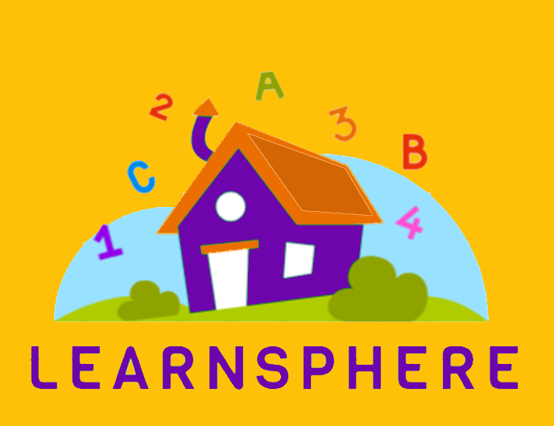
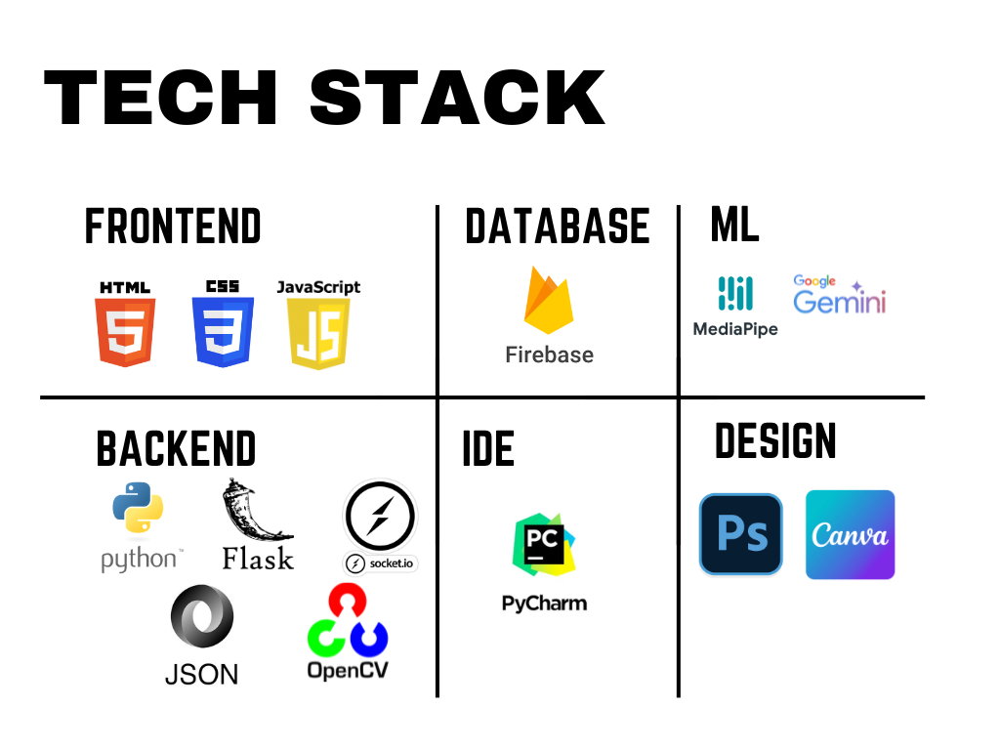

# LearnSphere: AI and AR-Powered Learning Platform
LearnSphere revolutionizes early childhood education with AR, AI, and gamified experiences. Our platform creates personalized, multisensory learning environments for pre-primary children, fostering cognitive, linguistic, and motor skills. Inclusive and adaptive, we bridge traditional teaching with modern needs, empowering young learners to thrive.


---


## Features
1. **Child-Friendly Interface:**  
   - Voice commands for easy navigation.  
   - AR activities for visual learning.  
   - Games and whiteboard for engagement.  

2. **Backend:**  
   - Flask with WebSocket integration for real-time interactions.  

3. **AI/AR Technologies:**  
   - Google Speech-to-Text for voice recognition.  
   - MediaPipe for gesture tracking.  
   - Gemini API for handwriting recognition.  
   - OpenCV for AR object tracking.  

4. **Database:**  
   - Firebase stores user sessions, quizzes, game states, and AR content.  

---

## Installation and Setup
Follow the steps below to set up the project locally:



### Prerequisites
- Python 3.8+
- Flask
- Node.js
- Firebase account
- Required API keys: Google Cloud, Firebase, Gemini API

### Steps
1. Clone the repository:  
   ```bash
   git clone <repository-URL>
   cd LearnSphere

2. Install dependencies:
   ```bash
   pip install -r requirements.txt

3. Set up environment variables:
Create a .env file in the root directory and add the following:
   ```bash
      GOOGLE_API_KEY=your-google-key
      FIREBASE_API_KEY=your-firebase-key
      GEMINI_API_KEY=your-gemini-key

4. Run the application:

   ```bash
      flask run


### Usage
Open the application in your browser.
Navigate through the child-friendly interface using voice commands or gestures.
Engage in AR-based activities, games, and quizzes.


